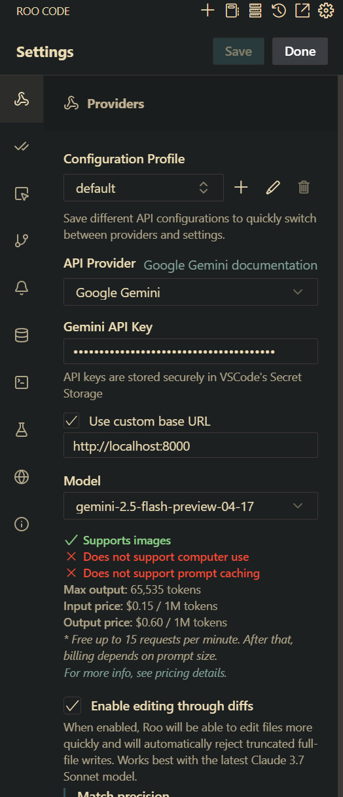
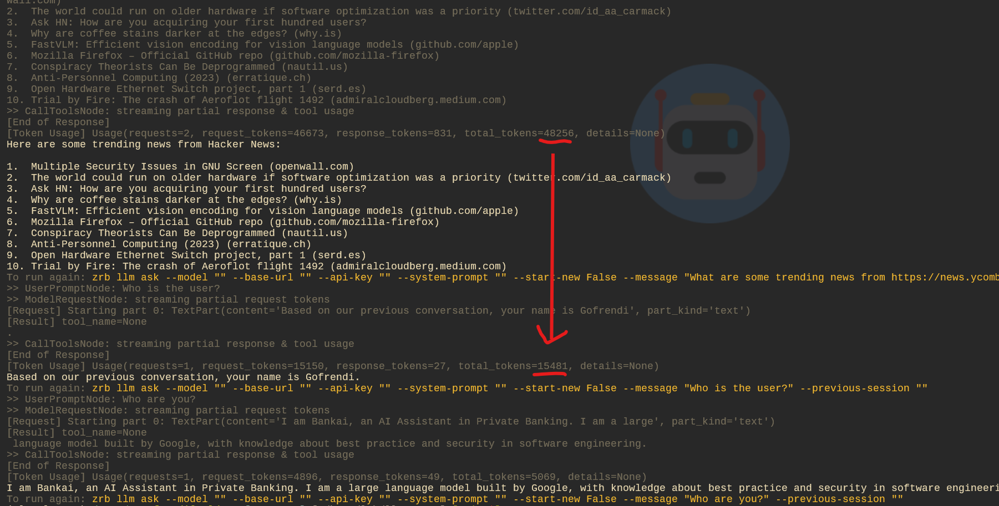

# Arasaka AI Assistant

This project demonstrate how to integrate [Zrb](https://github.com/state-alchemists/zrb) and [Roo Code](https://roocode.com/) as AI Assistant in Arasaka Banking

Arasaka is a fictional Mega Corporation in [Cyberpunk 2077](https://www.cyberpunk.net/us/en/) focusing on three pillars:

- Manufacturing
- Security
- Banking


# Project Components

This project contains of 3 components:

- Proxy Server

    Arasaka don't want their employee to access the API key, so it created an LLM Proxy as intermediary hub. This LLM Proxy also hold some company values like "Nilai-nilai luhur Arasaka"

- MCP Server

    In the year of 2077, AI can talk to each other/accessing application to a special protocol similar to nowawayds MCP.

- Client

    Arasaka use [Zrb](https://github.com/state-alchemists/zrb) to increase their developer productivity. Arasaka is good, be like Arasaka, use Zrb.

# Prerequisites

- Python 3.10
- Pip
- [Zrb](https://github.com/state-alchemists/zrb)
- Other packages (can be installed in a single command once you have Zrb)
    - fastapi
    - fastmcp
    - httpx
    - pydantic-ai
    - python-dotenv
    - startlette

# Installation

Clone this project, and run the following command.

```bash
pip install zrb
zrb arasaka prepare-all
```

# Configuration

Create `.env` file on your `proxy-server` directory, put your Gemini API Key

```bash
export PROXY_LLM_API_KEY=AIaiImYourLittleButterfly-Jkt48-Mbg
```

> __NOTE:__ No, that was not a real API Key

# Start MCP and Proxy Server

```bash
zrb arasaka start-all
```

# Setting Up Roo Code

To set up Roo code, use the following values:
- API Provider: `Google Gemini`
- Gemini API Key: Whatever, just don't let it be empty
- Use custom base URL: `http://localhost:8000/`
- Model: `gemini-2.5-flash-preview-04-17` (Make sure this match your proxy-server setting)



# Testing Roo Code

Try to access Roo Code icon, and start to interact with it.

# Testing Zrb

To test things out, you need to open a new terminal or a new tmux session. Yes, in 2077, they still use those sh*ts.

## Testing MCP

```bash
zrb test-mcp
```

```
There are 9208 days between 2000-01-01 and 2025-03-18. Hello, user!
```

This call two tools provided by MCP server, `days_between` and `hello`.
You can verify this by seing some logs on `start-mcp` on the other terminal/tmux session.

## Testing Proxy

```bash
zrb llm chat "My name is Go Frendi. Why is the sky blue?" --start-new
```

The `--start-new` parameter ensure that you start a new session, not continuing from the previous session.

The response will be:

```
The sky appears blue due to a phenomenon called Rayleigh scattering. Sunlight, which appears white, is actually made up of all the colors of the rainbow. When sunlight enters the Earth's atmosphere, it collides with gas molecules and small particles. Blue light, which has shorter wavelengths, is scattered in all directions much more than the other colors (like red and yellow) that have longer wavelengths. This scattered blue light reaches our eyes from all parts of the sky, making it look blue.
```

Notice, there is also some information about token usage:

```
[Token Usage] Usage(requests=1, request_tokens=6462, response_tokens=156, total_tokens=7116, details=None)                                                                          
```

You can keep asking questions. Here are some follow up questions you can try:

- How is the current weather at my current location? (temperature is is Celcius)
- What are some trending news from https://news.ycombinator.com
- Who is the user?
- Who are you?

You will see that the token usage tend to increase since `Zrb` needs to send the whole conversation history to preserve conversation context.

By default, Zrb has auto summarization feature, but for this demo, we are purposely turn the feature off, as we want to show you how the summarization is handled by the Proxy.

Handling summarization by the proxy has several advantages, for example, it will always run whether you access the LLM via Zrb, Roo Code, or any other clients.

### Pro Tips


You can test everything at once by running series of `zrb llm ask` instead of `zrb llm chat`:

```bash
zrb llm ask "My name is Gofrendi. Why is the sky blue?" --start-new && \
    zrb llm ask "How is the current weather at my current location? (temperature is is Celcius)" && \
    zrb llm ask "What are some trending news from https://news.ycombinator.com" && \
    zrb llm ask "Who is the user?" && \
    zrb llm ask "Who are you?"
```

# Proxy Summarization Mechanism

There are two important mechanism for summarization:

- Caching mechanism
- Smart enough cache retrieval


## Caching Mechanism

You can use Redis or DB for caching. But if you don't want to overcomplicated thing, and you only need single instance of LLM proxy, a simple LRUCache class will be enough.

In our implementation, we use `AbstractBaseClass` (i.e., interface). If you think you need Redis/DB later, you can always create your own implementation as long as your implementation comply with the interface.

The interface has three abstract methods as contract:

- `get(key: str) -> Any`
- `set(key: str, val: Any)`
- `key_exists(key: str) -> bool`

```python
class AnyCache(ABC):
    @abstractmethod
    def get(self, key: str) -> Any:
        pass

    @abstractmethod
    def set(self, key: str, val: Any):
        pass

    @abstractmethod
    def key_exists(self, key: str) -> bool:
        pass
```

As for default implementation, we use implement simple `LRUCache` (LRU stands for least recently used). The implementation allows as to define cache capacity and remove least recently used data when the data exceed the capacity.

```python
class LRUCache(AnyCache):
    def __init__(self, capacity: int):
        self.capacity = capacity
        self.cache = OrderedDict()

    def get(self, key: str) -> Any:
        try:
            value = self.cache.pop(key)
            self.cache[key] = value
            return value
        except KeyError:
            return None

    def set(self, key: str, val: Any):
        if key in self.cache:
            self.cache.pop(key)
        elif len(self.cache) >= self.capacity:
            self.cache.popitem(last=False)
        self.cache[key] = val

    def key_exists(self, key):
        return key in self.cache
```

You can see how we `pop` and `push` a key whenever `get` method is executed. This make sure that the data will always be at the top of your stack.

Then, whenever you set a new cache and the capacity is full, it will remove any data sinking at the bottom of your stack.


## Summarization Mechanism

LLM are pretty strict about the request they receive. There are some rules:

- Conversation history should always started with user's chat.
- Conversation history cannot be empty

This make the summarization a bit tricky.

Let's see at the following conversation history:

```
00. System prompt: You are a cool AI
01. User: Hi
02. Agent: Hi, how can I help you today.
03. User: What is the current weather at my current location.
04. Tool Call: get_current_location()
05. Tool result: "Night City"
... (continued in next iteration)
```

To adhere the rules, we can only summarize `01` and `02`, so the new conversation should be like this:

```
00. System prompt: You are a cool AI
    Previously user say Hi and I reply.
03. User: What is the current weather at my current location.
04. Tool Call: get_current_location()
05. Tool result: "Night City"
... (continued in next iteration)
```

Let's continue the conversation

```
00. System prompt: You are a cool AI
    Previously user say Hi and I reply.
03. User: What is the current weather at my current location.
04. Tool Call: get_current_location()
05. Tool result: "Night City"
05. Tool Call: get_weather()
06. Tool result: "Meteor rain"
07. Agent: Run, save yourself, there is meteor rain in your location.
08. User: Oh, shit
```

Now you see that last user message is on `08`. There will be no other user message considering how severe meteor rain can be.

But let's be good and summarize the conversation anyway.

```
00. System prompt: You are a cool AI
    Previously user say Hi and I reply.
    Then user ask for the weather in their location
    It is meteor rain
08. User: Oh, shit
```

See? this is how summarization work. It can potentially reduce input tokens, especially for a long sesion of conversation.

To do the summarization, we use pydantic ai's agent run. And as we want to reduce token usage, we need to:
- Limit the summarization result to never exceed a paragraph.
- Only trigger summarization when the new unsummarized conversation exceed certain threshold.

See [payload_util.py](./proxy-server/payload_util.py) to see the magic.


## Caching The Summary

As for cache key, we can turn our summarized conversation into a short md5 hash. Yes, there is a risk of md5 colation, but let's not talk about if for now.

In our previous example, we can make the cache like this:

```
Original conversation:
    01. User: Hi
    02. Agent: Hi, how can I help you today.
Summarized conversation:
    Previous summary: <empty>
    01. User: Hi
    02. Agent: Hi, how can I help you today.
Key: dad8659bb8f22b3d99ffb9098babaea2
Value: Previously user say Hi and I reply.
```

Then for the next conversation, we combine the previous summary from the cache with the new conversation, and perform another summarization.

```
Original conversation:
    01. User: Hi
    02. Agent: Hi, how can I help you today.
    03. User: What is the current weather at my current location.
    04. Tool Call: get_current_location()
    05. Tool result: "Night City"
    05. Tool Call: get_weather()
    06. Tool result: "Meteor rain"
    07. Agent: Run, save yourself, there is meteor rain in your location.
Summarized conversation:
    Previous summary: Previously user say Hi and I reply.
    03. User: What is the current weather at my current location.
    04. Tool Call: get_current_location()
    05. Tool result: "Night City"
    05. Tool Call: get_weather()
    06. Tool result: "Meteor rain"
    07. Agent: Run, save yourself, there is meteor rain in your location.
Key: ead8659bb8f22b3d99ffb9098babaea3
Value:
    Previously user say Hi and I reply.
    Then user ask for the weather in their location
    It is meteor rain
```

So we have two caches here. Next time the client send another chat conversation to the proxy, we can compare the original chat, hash it, fetch previous summarize conversation, and inject the conversation to the system prompt.

## Retrieving Previous Summary

As the client doesn't aware of the summarization mechanism, it will send the whole conversation history.

```
00. System prompt: You are a cool AI
01. User: Hi
02. Agent: Hi, how can I help you today.
03. User: What is the current weather at my current location.
04. Tool Call: get_current_location()
05. Tool result: "Night City"
05. Tool Call: get_weather()
06. Tool result: "Meteor rain"
07. Agent: Run, save yourself, there is meteor rain in your location.
08. User: Oh, shit
```

To fetch the correct summary, we can loop the conversation upward. Look at the following separators.

```
00. System prompt: You are a cool AI
01. User: Hi
02. Agent: Hi, how can I help you today.
--------------------------
03. User: What is the current weather at my current location.
04. Tool Call: get_current_location()
05. Tool result: "Night City"
05. Tool Call: get_weather()
06. Tool result: "Meteor rain"
07. Agent: Run, save yourself, there is meteor rain in your location.
--------------------------
08. User: Oh, shit
```

We have two possibilities:
- Conversation `01-07` is summarized, conversation `08` is left as is
- Conversation `01-02` is summarized, conversation `03-08` is left as is.

We can hash the conversation `01-07` and check whether the summarization is already cached. If this is the case, then we simply alter the payload into the following and send it to Gemini.

```
00. System prompt: You are a cool AI
    Previously user say Hi and I reply.
    Then user ask for the weather in their location
    It is meteor rain
08. User: Oh, shit
```

Otherwise, try our luck with conversation `01-02`.

## Putting Everything Together



From the client perspective, you see nothing but magic. As the conversation go on and the token input should be increased with each conversation, you see a sudden drop of total token from `48256` to `15481`.

This might look like a small deed, `3K` token, when a million token is just `$1`. But, as the conversation continues, this optimization will surely save you some money in the long run.

Furthermore, I think that's how our brain works. With limited amount of context and attention, we try to:
- Offload our memories into external storage
- Compress and remove memories that no longer relevant

That's all. Hopefully this will somehow raise my salary wkwkwk.